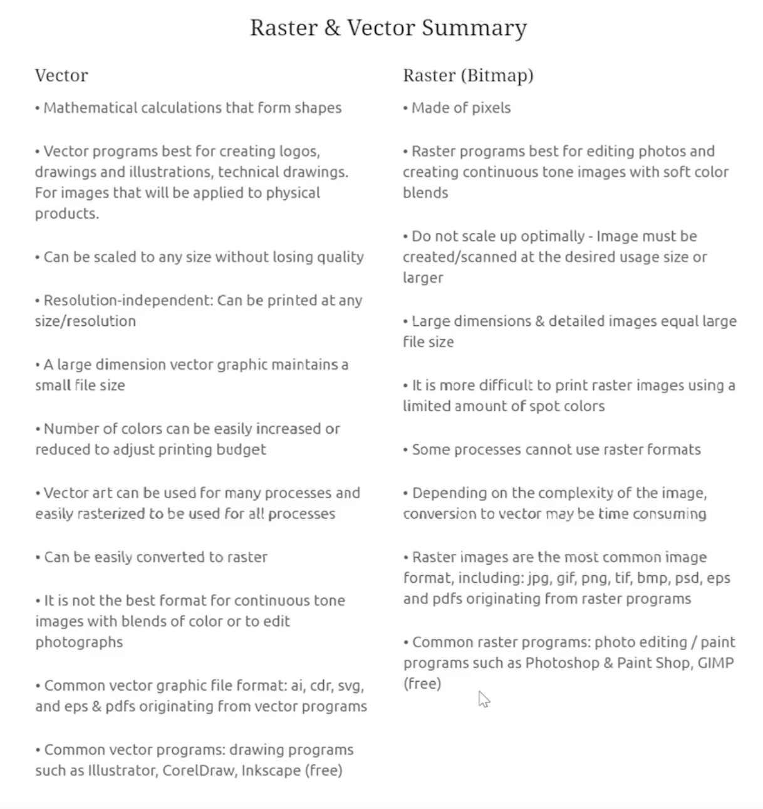

Bitmap/Raster - painting with pixels
    png, jgp, etc...

Vectors - painting with vectors
    svg

Enlarging raster will create blur
Enlarge vector math formulas are the same so image stays consistent

